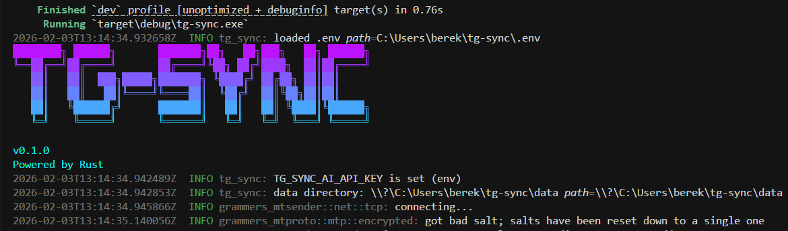

<div align="center">

# TG-SYNC

**High-Performance, Resilient Telegram Archiving System**

[](https://www.rust-lang.org/)
[](LICENSE)

A CLI userbot to incrementally backup Telegram chats and groups (with media), run AI-powered weekly digests, and optionally push action items to Trello. Built for high throughput and ACID-safe persistence. **Cyberpunk/Neon TUI** (Terminal User Interface) with a stylized ASCII banner—powered by Rust.

</div>

---

## Overview

`tg-sync` is an enterprise-grade archival solution designed to handle **large datasets** without OOM or FLOOD_WAIT bans. It uses the **MTProto** protocol via [grammers](https://github.com/Lonami/grammers) (user-mode, not Bot API) for full control over API interactions, rate limiting, and session management. The codebase follows **Hexagonal Architecture** (Ports & Adapters), keeping business logic in use cases and infrastructure in adapters.

On startup you get a **Cyberpunk/Neon**-themed terminal UI: gradient "TG-SYNC" banner (Neon Purple → Cyber Green), version, and "Powered by Rust". Interactive menus use the same neon palette (`[?]` prompts, colored chat-type indicators).



---

## Features

- **Incremental backup** — Fetches only messages newer than the last checkpoint. Producer–consumer pipeline with a **bounded channel** (default capacity 1000): when the media queue is full, the sync producer blocks on `send().await`, providing backpressure so memory stays bounded.
- **Message versioning** — Edited messages are tracked in SQLite: a `history_json` column stores prior versions (date + text). On conflict, the previous text is appended to the history before updating; edit history is exposed on the domain `Message` as `edit_history`.
- **Watcher mode (daemon)** — Periodically syncs a configurable set of **target** chats, scans new messages for keywords (e.g. *Urgent*, *Bug*, *Error*, *Production*), and sends **alerts to Saved Messages** when a match is found. Cycle interval is configurable (default 600 s).
- **AI Analysis** — **Map-Reduce** for large chats: messages are chunked by size (~50k chars); each chunk is summarized by the LLM, then combined summaries are analyzed for the final weekly report. Supports **OpenAI** and compatible APIs (e.g. **Ollama**). Reports are written as **Markdown** under `data/reports/` (e.g. `analysis_{chat_id}_{year}-{week}.md`). If `TG_SYNC_AI_API_KEY` is not set, a **mock adapter** is used so the TUI and workflows run without real LLM calls.
- **Trello integration** — When `TRELLO_KEY`, `TRELLO_TOKEN`, and `TRELLO_LIST_ID` are set, **action items** from the AI analysis are created as cards on the given list.
- **Resilience** — FLOOD_WAIT handling, retries with backoff for media downloads, persistent **entity registry** (access_hash cache) to avoid redundant getDialogs, **WAL** SQLite, and atomic state writes (write-replace for `state.json`).

---

## Architecture

The application uses **Hexagonal Architecture** (Ports & Adapters):

- **Domain** — Pure entities and errors (`entities.rs`, `errors.rs`): `Chat`, `Message`, `MediaReference`, `MessageEdit`, `AnalysisResult`, `ActionItem`, `WeekGroup`, etc.
- **Ports** — **Inbound:** `InputPort` (run menu, run_sync, run_auth). **Outbound:** `TgGateway`, `RepoPort`, `StatePort`, `AuthPort`, `EntityRegistry`, `AiPort`, `AnalysisLogPort`, `TaskTrackerPort`.
- **Adapters** — Telegram (grammers), SQLite (libsql), state (state_json), AI (OpenAI + mock), Trello, UI (inquire + indicatif + crossterm, Cyberpunk/Neon theme and banner).
- **Use cases** — `SyncService`, `MediaWorker`, `WatcherService`, `AnalysisService`, `AuthService`.

Pipeline: **SyncService** (producer) fetches messages and enqueues media refs into a bounded **mpsc** channel; **MediaWorker** (consumer) downloads media with semaphore-limited concurrency. Messages are saved in transactional batches; state is updated after a successful save.

---

## Installation & Setup

### Prerequisites

- **Rust** 1.85+ (stable, 2024 edition) — [Install Rust](https://rustup.rs/)
- **Telegram API** — [Create an app](https://my.telegram.org/apps) and get **API ID** and **API Hash**.
- **SQLite** — Provided by the `libsql` crate; no system install needed.

### Build

```bash
git clone https://github.com/Berektassuly/tg-sync.git
cd tg-sync
cargo build --release
```

Binary: `target/release/tg-sync.exe` (Windows) or `target/release/tg-sync` (Unix).

### Docker

Use the included **Dockerfile** and **docker-compose.yml**:

```bash
# Copy .env.example to .env and set TG_SYNC_API_ID, TG_SYNC_API_HASH
docker compose up --build -it

# Or build and run manually
docker build -t tg-sync:latest .
docker run -it --env-file .env -v tg-sync-data:/app/data -v tg-sync-session:/app/session tg-sync:latest
```

Requires Docker 20.10+ with BuildKit. Use `-it` for interactive TUI and auth. Session and data persist via volumes.

---

## Configuration

Configuration is loaded from **environment variables** (and optionally a file via `TG_SYNC_CONFIG`). Create a `.env` in the project root (see `.env.example`). Options are read from `config.rs` with the `TG_SYNC_` prefix unless noted.

| Variable | Required | Default | Description |
|----------|----------|---------|-------------|
| `TG_SYNC_API_ID` | **Yes** | — | Telegram API ID |
| `TG_SYNC_API_HASH` | **Yes** | — | Telegram API Hash |
| `TG_SYNC_DATA_DIR` | No | `./data` | Directory for messages.db, media, state.json, reports |
| `TG_SYNC_SESSION_PATH` | No | `./session.db` | MTProto session path |
| `TG_SYNC_CONFIG` | No | — | Optional config file (e.g. config.toml) |
| `EXPORT_DELAY_MS` | No | — | Delay (ms) before each message-history API request (rate limiting) |
| `SYNC_DELAY_MS` | No | `500` | Delay (ms) between sync batch requests (avoid FLOOD_WAIT) |
| `TG_SYNC_MEDIA_QUEUE_SIZE` | No | `1000` | Bounded channel capacity for media pipeline (backpressure) |
| `TG_SYNC_WATCHER_CYCLE_SECS` | No | `600` | Seconds between watcher sync cycles |
| `TG_SYNC_AI_API_KEY` | No | — | OpenAI or compatible API key; if unset, mock AI adapter is used |
| `TG_SYNC_AI_API_URL` | No | OpenAI URL | Chat completions endpoint (e.g. Ollama: `http://localhost:11434/v1/chat/completions`) |
| `TG_SYNC_AI_MODEL` | No | `gpt-4o-mini` | Model name (e.g. Ollama: `llama3.2`, `mistral`) |
| `TRELLO_KEY` | No | — | Trello API key ([trello.com/app-key](https://trello.com/app-key)) |
| `TRELLO_TOKEN` | No | — | Trello API token |
| `TRELLO_LIST_ID` | No | — | List ID where action-item cards are created (required for Trello) |
| `TRELLO_BOARD_ID` | No | — | Board ID (optional) |

---

## Usage

```bash
cargo run --release
# or
./target/release/tg-sync
```

On first run you’re prompted to sign in (phone, code, 2FA if enabled). Session is stored in `session.db` for reuse.

**Interactive modes** (TUI menu):

| Mode | Description |
|------|-------------|
| **Full Backup** | Sync all non-blacklisted dialogs: fetch history, persist to SQLite, download media. |
| **Manage Blacklist** | Exclude specific chats from backup. |
| **Watcher / Daemon** | Loop: sync target chats → check new messages for keywords → send alerts to Saved Messages → sleep (cycle configurable). |
| **AI Analysis** | Generate weekly digest reports per chat (Map-Reduce over chunks); optionally create Trello cards for action items. |

---

## Output Structure

```
./
├── session.db              # MTProto session (persistent login)
└── data/
    ├── messages.db         # SQLite (all chats, WAL); messages have history_json for edits
    ├── state.json          # Sync checkpoints (last_message_id per chat)
    ├── media/              # Downloaded media: {chat_id}_{msg_id}.ext
    └── reports/            # AI weekly digests: analysis_{chat_id}_{year}-{week}.md
```

---

## Tech Stack

| Category | Library | Purpose |
|----------|---------|---------|
| **Runtime** | [tokio](https://tokio.rs/) | Async runtime (multi-threaded) |
| **Telegram** | [grammers](https://github.com/Lonami/grammers) | MTProto client (user-mode) |
| **Database** | [libsql](https://github.com/tursodatabase/libsql) | SQLite, WAL, async |
| **Serialization** | [serde](https://serde.rs/) / [serde_json](https://github.com/serde-rs/json) | JSON for media refs, state, analysis |
| **Error** | [thiserror](https://github.com/dtolnay/thiserror) / [anyhow](https://github.com/dtolnay/anyhow) | Domain errors and context |
| **Logging** | [tracing](https://tracing.rs/) | Structured logging |
| **Config** | [config](https://github.com/mehcode/config-rs) / [dotenv](https://github.com/dotenv-rs/dotenv) | Layered config (env + file) |
| **TUI** | [inquire](https://github.com/mikaelmello/inquire) / [indicatif](https://github.com/console-rs/indicatif) / [crossterm](https://github.com/crossterm-rs/crossterm) / [figlet-rs](https://github.com/kennykaye/figlet-rs) | Prompts, progress, Cyberpunk/Neon banner |
| **AI** | [reqwest](https://github.com/reqwest/reqwest) | HTTP client for OpenAI/Ollama |
| **Time** | [chrono](https://github.com/chronotope/chrono) | Week grouping, report timestamps |

---

## Contact

**Mukhammedali Berektassuly**

> This project was built with 💜 by a 17-year-old developer from Kazakhstan

- Website: [berektassuly.com](https://berektassuly.com)
- Email: [mukhammedali@berektassuly.com](mailto:mukhammedali@berektassuly.com)
- X/Twitter: [@berektassuly](https://x.com/berektassuly)

---

## License

This project is licensed under the MIT License. See [LICENSE](LICENSE) for details.
